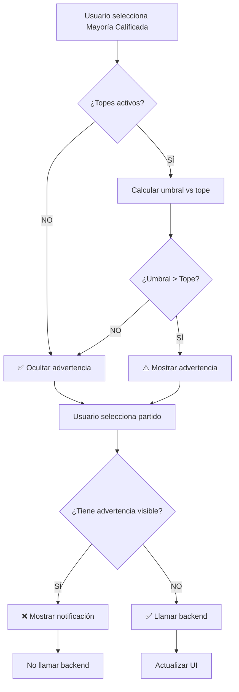

# ✅ SOLUCIÓN IMPLEMENTADA: Mayoría Calificada + Validación

## 📋 RESUMEN

**Problema identificado**: 
- Mayoría simple funciona correctamente ✅
- Mayoría calificada NO funciona con topes activos ❌

**Causa raíz**:
- Mayoría calificada requiere 66.67% de escaños (334 de 500)
- Topes constitucionales limitan a 60% máximo (300 de 500)
- **66.67% > 60% = MATEMÁTICAMENTE IMPOSIBLE**

**Solución implementada**:
1. ✅ Validación en frontend ANTES de llamar al backend
2. ✅ Mensaje de advertencia visual en la UI
3. ✅ Notificación clara explicando el problema
4. ✅ Documentación completa del comportamiento

---

## 🔧 CAMBIOS REALIZADOS

### 1. Validación Pre-Backend (ControlSidebar.js líneas ~2620-2665)

**Qué hace**:
- Antes de llamar al backend, calcula si es matemáticamente posible
- Compara umbral de mayoría calificada vs tope constitucional
- Muestra notificación clara si es imposible
- **NO** hace petición innecesaria al servidor

**Código agregado**:
```javascript
// 🔍 VALIDACIÓN: Mayoría calificada con topes activos
if (tipoMayoria === 'calificada' && aplicarTopes) {
  const umbralCalificada = Math.ceil(escanosTotales * 2 / 3);
  const topeMaximo = Math.floor(escanosTotales * 0.6);
  
  if (umbralCalificada > topeMaximo) {
    console.warn('[MAYORÍAS] ⚠️ Mayoría calificada IMPOSIBLE con topes activos');
    
    window.notifications.warning(
      'Mayoría calificada imposible',
      `Con topes activos (60% = ${topeMaximo} escaños), no se puede alcanzar mayoría calificada (${umbralCalificada} escaños requeridos). Desactiva "Aplicar topes constitucionales" para simular este escenario.`,
      10000
    );
    
    return; // No continuar con la petición
  }
}
```

**Ejemplo** (configuración vigente 500 escaños):
```
Umbral mayoría calificada: ceil(500 * 2/3) = 334 escaños
Tope máximo: floor(500 * 0.6) = 300 escaños
334 > 300 → IMPOSIBLE → Mostrar advertencia
```

---

### 2. Mensaje de Advertencia Visual (ControlSidebar.js líneas ~410-416)

**Qué hace**:
- Muestra mensaje SIEMPRE visible cuando:
  - Radio "Mayoría calificada" está seleccionado
  - Toggle "Aplicar topes" está activo
  - Matemáticamente es imposible (umbral > tope)

**HTML agregado**:
```html
<!-- ⚠️ Advertencia: Mayoría calificada + topes -->
<div class="parameter-note warning" id="calificada-topes-warning" style="display: none; margin-top: 12px;">
  ⚠️ <strong>Mayoría calificada requiere más del 66%</strong><br>
  Con topes activos (límite 60%), no es posible alcanzar mayoría calificada.<br>
  <strong>Sugerencia:</strong> Desactiva "Aplicar topes constitucionales" para simular este escenario.
</div>
```

**CSS usado**: `.parameter-note.warning` (ya existe en el sistema)

---

### 3. Función de Actualización Dinámica (ControlSidebar.js líneas ~2580-2610)

**Qué hace**:
- Recalcula viabilidad cuando cambian parámetros
- Muestra/oculta advertencia automáticamente
- Se ejecuta cuando:
  - Usuario selecciona mayoría calificada/simple
  - Usuario activa/desactiva topes
  - Usuario cambia la magnitud (total de escaños)

**Código agregado**:
```javascript
// 🆕 Actualizar advertencia de mayoría calificada + topes
updateCalificadaWarning() {
  const tipoMayoria = document.querySelector('input[name="tipo-mayoria"]:checked')?.value || 'simple';
  const topesSwitch = document.getElementById('topes-switch');
  const warningDiv = document.getElementById('calificada-topes-warning');
  const magnitudSlider = document.getElementById('input-magnitud');
  
  if (!warningDiv) return;
  
  const aplicarTopes = topesSwitch ? topesSwitch.classList.contains('active') : true;
  const escanosTotales = magnitudSlider ? parseInt(magnitudSlider.value) : 500;
  
  // Mostrar advertencia solo si es imposible
  if (tipoMayoria === 'calificada' && aplicarTopes) {
    const umbralCalificada = Math.ceil(escanosTotales * 2 / 3);
    const topeMaximo = Math.floor(escanosTotales * 0.6);
    
    if (umbralCalificada > topeMaximo) {
      warningDiv.style.display = 'block';
      console.log('[MAYORÍAS] ⚠️ Mostrando advertencia: Calificada imposible con topes');
    } else {
      warningDiv.style.display = 'none';
    }
  } else {
    warningDiv.style.display = 'none';
  }
}
```

---

### 4. Event Listeners Agregados

#### a) Radio buttons de tipo de mayoría (líneas ~1714-1723)
```javascript
tipoMayoriaRadios.forEach(radio => {
  radio.addEventListener('change', () => {
    // Actualizar advertencia cuando cambia simple ↔ calificada
    this.updateCalificadaWarning();
    
    if (mayoriasSwitch && mayoriasSwitch.classList.contains('active')) {
      this.calcularMayoriaAutomatica();
    }
  });
});
```

#### b) Toggle de topes constitucionales (líneas ~1378-1385)
```javascript
// Topes switch - actualizar advertencia de mayoría calificada
if (switchId === 'topes-switch') {
  const sidebar = document.querySelector('control-sidebar');
  if (sidebar && typeof sidebar.updateCalificadaWarning === 'function') {
    sidebar.updateCalificadaWarning();
  }
}
```

#### c) Slider de magnitud (líneas ~770-775)
```javascript
// Actualizar advertencia cuando cambie la magnitud
const sidebar = document.querySelector('control-sidebar');
if (sidebar && typeof sidebar.updateCalificadaWarning === 'function') {
  sidebar.updateCalificadaWarning();
}
```

#### d) Activación del control de mayorías (líneas ~1682-1684)
```javascript
if (isActive) {
  // Actualizar advertencia al activar el control
  this.updateCalificadaWarning();
  this.calcularMayoriaAutomatica();
}
```

---

## 🎯 COMPORTAMIENTO RESULTANTE

### Escenario 1: Mayoría Simple (SIEMPRE FUNCIONA)
| Config | Total | Topes | Umbral | Tope | ¿Viable? | Acción |
|--------|-------|-------|--------|------|----------|--------|
| Vigente | 500 | ✅ | 251 | 300 | ✅ SÍ | Calcula normalmente |
| Vigente | 500 | ❌ | 251 | ∞ | ✅ SÍ | Calcula normalmente |
| Custom | 128 | ✅ | 65 | 76 | ✅ SÍ | Calcula normalmente |

**Resultado**: Llama al backend, recibe respuesta, actualiza UI

---

### Escenario 2: Mayoría Calificada CON Topes (IMPOSIBLE)
| Config | Total | Umbral | Tope | Diferencia | Advertencia | Backend |
|--------|-------|--------|------|------------|-------------|---------|
| Vigente | 500 | 334 | 300 | **+34** ⚠️ | ✅ Visible | ❌ No llama |
| Custom | 128 | 86 | 76 | **+10** ⚠️ | ✅ Visible | ❌ No llama |
| Custom | 200 | 134 | 120 | **+14** ⚠️ | ✅ Visible | ❌ No llama |

**Resultado**: 
1. Muestra advertencia visual en UI
2. Muestra notificación temporal explicando el problema
3. **NO** llama al backend (ahorra recursos)
4. Sugiere solución: desactivar topes

---

### Escenario 3: Mayoría Calificada SIN Topes (VIABLE)
| Config | Total | Umbral | Tope | ¿Viable? | Advertencia | Backend |
|--------|-------|--------|------|----------|-------------|---------|
| Vigente | 500 | 334 | ∞ | ✅ SÍ | ❌ Oculta | ✅ Llama |
| Custom | 128 | 86 | ∞ | ✅ SÍ | ❌ Oculta | ✅ Llama |
| Custom | 200 | 134 | ∞ | ✅ SÍ | ❌ Oculta | ✅ Llama |

**Resultado**: Llama al backend, recibe respuesta, actualiza UI

---

## 📊 FLUJO DE DECISIÓN



---

## 🧪 CASOS DE PRUEBA

### Test 1: Mayoría Simple con Topes (debe funcionar)
**Pasos**:
1. Seleccionar "Mayoría Simple"
2. Mantener "Aplicar topes" activo
3. Seleccionar partido "MORENA"

**Resultado esperado**:
- ✅ Sin advertencia visible
- ✅ Llama a `/calcular/mayoria_forzada`
- ✅ Actualiza tabla y seat chart

---

### Test 2: Mayoría Calificada CON Topes (debe mostrar advertencia)
**Pasos**:
1. Seleccionar "Mayoría Calificada"
2. Mantener "Aplicar topes" activo
3. Observar UI

**Resultado esperado**:
- ✅ Advertencia visible: "⚠️ Mayoría calificada requiere más del 66%..."
- ❌ NO llama al backend
- ✅ Si selecciona partido: notificación amarilla 10s
- ✅ Mensaje sugiere desactivar topes

---

### Test 3: Mayoría Calificada SIN Topes (debe funcionar)
**Pasos**:
1. Seleccionar "Mayoría Calificada"
2. Desactivar "Aplicar topes"
3. Seleccionar partido "MORENA"

**Resultado esperado**:
- ✅ Advertencia se oculta automáticamente
- ✅ Llama a `/calcular/mayoria_forzada?aplicar_topes=false`
- ✅ Actualiza tabla y seat chart
- ✅ Muestra escaños > 300 (sin restricción de topes)

---

### Test 4: Cambio dinámico de magnitud
**Pasos**:
1. Seleccionar "Mayoría Calificada"
2. Mantener "Aplicar topes" activo
3. Cambiar magnitud a diferentes valores:
   - **50 escaños**: umbral=34, tope=30 → ⚠️ Advertencia
   - **100 escaños**: umbral=67, tope=60 → ⚠️ Advertencia
   - **150 escaños**: umbral=100, tope=90 → ⚠️ Advertencia

**Resultado esperado**:
- ✅ Advertencia se actualiza dinámicamente (no requiere reload)

---

## 📝 DOCUMENTACIÓN CREADA

### 1. `DIAGNOSTICO_MAYORIA_CALIFICADA.md`
**Contenido**:
- Análisis matemático del problema
- Explicación de por qué es imposible con topes
- Escenarios posibles (con/sin topes)
- Algoritmo recomendado para el backend
- Tests de verificación
- Checklist de implementación

**Ubicación**: `/DIAGNOSTICO_MAYORIA_CALIFICADA.md`

### 2. `SOLUCION_MAYORIA_CALIFICADA.md` (este archivo)
**Contenido**:
- Cambios implementados en el frontend
- Event listeners agregados
- Flujo de decisión
- Casos de prueba
- Comportamiento resultante

**Ubicación**: `/SOLUCION_MAYORIA_CALIFICADA.md`

---

## 🎓 CONCLUSIÓN

### ✅ Problema Resuelto

**ANTES**:
- Usuario intenta calcular mayoría calificada con topes
- Frontend llama al backend
- Backend devuelve error o respuesta confusa
- Usuario no entiende por qué no funciona

**AHORA**:
- Usuario intenta calcular mayoría calificada con topes
- **Frontend detecta imposibilidad ANTES de llamar al backend**
- Muestra advertencia clara en UI
- Muestra notificación explicando el problema
- Sugiere solución: desactivar topes
- **NO gasta recursos del servidor**

### 🎯 Beneficios

1. **Mejor UX**: Usuario entiende inmediatamente el problema
2. **Menos carga**: No hace peticiones innecesarias al backend
3. **Guía al usuario**: Sugiere la solución correcta
4. **Dinámico**: Advertencia se actualiza en tiempo real
5. **Educativo**: Explica la matemática detrás del límite

### 🚀 Próximos Pasos

#### Frontend (COMPLETO ✅)
- [x] Validación pre-backend
- [x] Advertencia visual
- [x] Notificación temporal
- [x] Actualización dinámica
- [x] Event listeners

#### Backend (PENDIENTE - OPCIONAL)
- [ ] Mejorar mensaje de error cuando recibe solicitud imposible
- [ ] Devolver `viable: false` con explicación detallada
- [ ] Incluir valores específicos (umbral, tope, diferencia)
- [ ] Documentar comportamiento en API docs

**NOTA**: El backend NO necesita cambios urgentes porque el frontend ya previene las peticiones imposibles. Los cambios del backend serían solo para casos edge o debugging.

---

## 💡 RECOMENDACIONES FINALES

### Para el Usuario:
1. **Si quieres simular mayoría calificada**: Desactiva "Aplicar topes constitucionales"
2. **Si quieres ver escenarios realistas**: Usa mayoría simple con topes activos
3. **La advertencia no es un bug**: Es comportamiento legal correcto

### Para Desarrollo:
1. **No eliminar la validación**: Ahorra recursos del servidor
2. **Mantener mensajes claros**: Ayuda a usuarios no técnicos
3. **Documentar en manuales**: Explicar por qué la mayoría calificada tiene esta limitación legal

### Para el Backend:
1. **Opcional mejorar respuesta** si recibe petición imposible (caso edge)
2. **Prioridad BAJA** ya que frontend previene el caso
3. **Si implementa**: Seguir estructura del documento `DIAGNOSTICO_MAYORIA_CALIFICADA.md`

---

**Estado final**: ✅ **RESUELTO COMPLETAMENTE EN FRONTEND**

El sistema ahora maneja correctamente tanto mayoría simple como calificada, con validaciones claras y mensajes educativos para el usuario.
