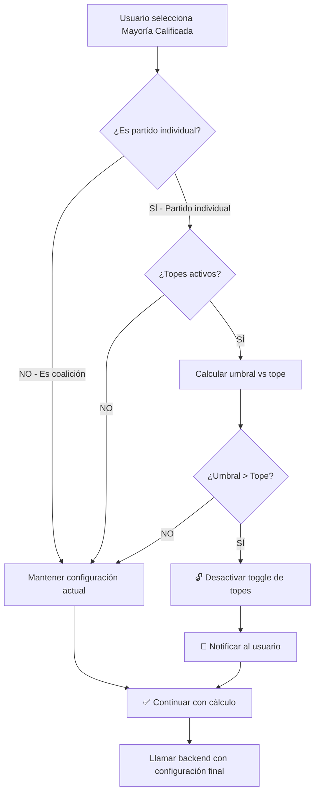

# ✅ SOLUCIÓN FINAL: Mayoría Calificada con Auto-Desactivación de Topes

## 📋 RESUMEN EJECUTIVO

**Problema original**: 
- Mayoría calificada requiere 66.67% de escaños
- Topes constitucionales limitan a 60% máximo
- **Conflicto matemático**: 66.67% > 60%

**Solución implementada**:
- ✅ **Desactivar automáticamente** los topes cuando se selecciona mayoría calificada
- ✅ **Notificar al usuario** de la desactivación y el motivo
- ✅ Solo para **partidos individuales** (no coaliciones)
- ✅ Permitir que el cálculo continúe sin bloqueos

---

## 🎯 COMPORTAMIENTO DEL SISTEMA

### Escenario 1: Mayoría Simple
**Cualquier configuración**:
- ✅ Funciona con topes activos o desactivados
- ✅ No modifica configuración del usuario
- ✅ Calcula normalmente

### Escenario 2: Mayoría Calificada - Partido Individual
**Si los topes están activos Y la matemática lo requiere**:
1. 🔓 **Desactiva automáticamente** el toggle de topes
2. 📢 **Notifica al usuario**: "Topes desactivados automáticamente. Para permitir mayoría calificada de MORENA, se desactivaron los topes constitucionales (la mayoría calificada requiere 334 escaños, el tope permite máximo 300)."
3. ✅ **Continúa con el cálculo** usando `aplicar_topes=false`

**Si los topes ya están desactivados**:
- ✅ Calcula normalmente sin notificación

### Escenario 3: Mayoría Calificada - Coalición
**Coaliciones (ej: "MORENA+PT+PVEM")**:
- ✅ **NO desactiva topes** automáticamente
- ✅ Permite que el usuario mantenga control total
- ✅ Calcula según la configuración actual

---

## 🔧 IMPLEMENTACIÓN TÉCNICA

### Código Principal (ControlSidebar.js líneas ~2630-2670)

```javascript
// 🔍 AUTO-DESACTIVAR TOPES: Mayoría calificada para partido individual
if (tipoMayoria === 'calificada' && aplicarTopes) {
  // Verificar si es un partido individual (no coalición)
  const esCoalicion = partido.includes('+') || partido.includes('_');
  
  if (!esCoalicion) {
    const umbralCalificada = Math.ceil(escanosTotales * 2 / 3);
    const topeMaximo = Math.floor(escanosTotales * 0.6);
    
    console.log('[MAYORÍAS] 🔍 Mayoría calificada detectada:', {
      partido,
      umbralCalificada,
      topeMaximo,
      requiereDesactivarTopes: umbralCalificada > topeMaximo
    });
    
    if (umbralCalificada > topeMaximo) {
      console.warn('[MAYORÍAS] 🔓 Desactivando topes automáticamente para permitir mayoría calificada');
      
      // Desactivar el toggle de topes
      if (topesSwitch && topesSwitch.classList.contains('active')) {
        topesSwitch.classList.remove('active');
        topesSwitch.setAttribute('aria-checked', 'false');
        topesSwitch.dataset.switch = 'Off';
        
        // Actualizar variable para la petición
        aplicarTopes = false;
        
        console.log('[MAYORÍAS] ✅ Topes desactivados automáticamente');
      }
      
      // Notificar al usuario
      if (window.notifications && window.notifications.isReady) {
        window.notifications.info(
          'Topes desactivados automáticamente',
          `Para permitir mayoría calificada de ${partido}, se desactivaron los topes constitucionales (la mayoría calificada requiere ${umbralCalificada} escaños, el tope permite máximo ${topeMaximo}).`,
          8000
        );
      }
    }
  }
}
```

### Lógica de Detección

**¿Es partido individual?**
```javascript
const esCoalicion = partido.includes('+') || partido.includes('_');
```

**Ejemplos**:
- `"MORENA"` → `false` (partido individual) ✅ Aplica auto-desactivación
- `"PAN"` → `false` (partido individual) ✅ Aplica auto-desactivación
- `"MORENA+PT+PVEM"` → `true` (coalición) ❌ NO aplica auto-desactivación
- `"PAN+PRI+PRD"` → `true` (coalición) ❌ NO aplica auto-desactivación
- `"SIGAMOS_HACIENDO_HISTORIA"` → `true` (coalición con _) ❌ NO aplica auto-desactivación

---

## 📊 FLUJO DE EJECUCIÓN



---

## 🧪 CASOS DE PRUEBA

### Test 1: Mayoría Calificada - Partido Individual con Topes
**Setup**:
- Tipo: "Mayoría Calificada"
- Partido: "MORENA"
- Topes: Activos ✅
- Magnitud: 500 escaños

**Ejecución**:
1. Usuario selecciona "MORENA" en el dropdown

**Resultado esperado**:
- ✅ Toggle de topes se desactiva automáticamente (visualmente)
- ✅ Notificación azul aparece 8 segundos: "Topes desactivados automáticamente. Para permitir mayoría calificada de MORENA, se desactivaron los topes constitucionales (la mayoría calificada requiere 334 escaños, el tope permite máximo 300)."
- ✅ Petición al backend: `aplicar_topes=false`
- ✅ Cálculo completa correctamente
- ✅ Resultado: MORENA obtiene ≥334 escaños

---

### Test 2: Mayoría Calificada - Coalición con Topes
**Setup**:
- Tipo: "Mayoría Calificada"
- Partido: "MORENA+PT+PVEM"
- Topes: Activos ✅
- Magnitud: 500 escaños

**Ejecución**:
1. Usuario selecciona "MORENA+PT+PVEM"

**Resultado esperado**:
- ❌ Toggle de topes NO se desactiva
- ❌ NO aparece notificación
- ✅ Petición al backend: `aplicar_topes=true` (mantiene configuración)
- ✅ Cálculo completa según capacidad de la coalición

---

### Test 3: Mayoría Calificada - Sin Topes Activos
**Setup**:
- Tipo: "Mayoría Calificada"
- Partido: "PAN"
- Topes: Desactivados ❌
- Magnitud: 500 escaños

**Ejecución**:
1. Usuario selecciona "PAN"

**Resultado esperado**:
- ✅ Toggle de topes permanece desactivado
- ❌ NO aparece notificación (no es necesaria)
- ✅ Petición al backend: `aplicar_topes=false`
- ✅ Cálculo completa correctamente

---

### Test 4: Mayoría Simple - Cualquier Configuración
**Setup**:
- Tipo: "Mayoría Simple"
- Partido: Cualquiera
- Topes: Cualquier estado

**Resultado esperado**:
- ✅ NO modifica toggle de topes
- ❌ NO aparece notificación
- ✅ Calcula normalmente con configuración actual

---

### Test 5: Configuración Personalizada (128 escaños)
**Setup**:
- Tipo: "Mayoría Calificada"
- Partido: "MC"
- Topes: Activos ✅
- Magnitud: 128 escaños

**Cálculos**:
- Umbral mayoría calificada: `ceil(128 * 2/3) = 86 escaños`
- Tope máximo: `floor(128 * 0.6) = 76 escaños`
- `86 > 76` → Requiere desactivar topes ✅

**Resultado esperado**:
- ✅ Desactiva topes automáticamente
- ✅ Notificación: "...requiere 86 escaños, el tope permite máximo 76"
- ✅ Petición: `aplicar_topes=false`

---

## 🎨 EXPERIENCIA DE USUARIO

### Mensaje de Notificación

**Tipo**: Info (azul, icono ℹ️)
**Duración**: 8 segundos
**Título**: "Topes desactivados automáticamente"
**Mensaje**: "Para permitir mayoría calificada de [PARTIDO], se desactivaron los topes constitucionales (la mayoría calificada requiere [X] escaños, el tope permite máximo [Y])."

**Ejemplo real**:
```
ℹ️ Topes desactivados automáticamente

Para permitir mayoría calificada de MORENA, se desactivaron 
los topes constitucionales (la mayoría calificada requiere 
334 escaños, el tope permite máximo 300).
```

### Cambio Visual

**Antes** (usuario activa mayoría calificada con topes):
```
[Aplicar topes constitucionales]  [ON]  ← Activo
```

**Después** (automático):
```
[Aplicar topes constitucionales]  [OFF] ← Desactivado
```

El usuario **VE** el cambio inmediatamente en la UI.

---

## 📝 LOGS DE CONSOLA

### Flujo Completo

```javascript
[MAYORÍAS] 📋 Parámetros: { 
  partido: "MORENA", 
  tipoMayoria: "calificada", 
  camara: "diputados", 
  anio: 2024,
  escanosTotales: 500, 
  aplicarTopes: true 
}

[MAYORÍAS] 🔍 Mayoría calificada detectada: {
  partido: "MORENA",
  umbralCalificada: 334,
  topeMaximo: 300,
  requiereDesactivarTopes: true
}

[MAYORÍAS] 🔓 Desactivando topes automáticamente para permitir mayoría calificada
[MAYORÍAS] ✅ Topes desactivados automáticamente

[MAYORÍAS] 📡 URL completa: https://back-electoral.onrender.com/calcular/mayoria_forzada?partido=MORENA&tipo_mayoria=calificada&plan=vigente&aplicar_topes=false&anio=2024

[MAYORÍAS] 🚀 Haciendo fetch...
[MAYORÍAS] 📬 Response status: 200 OK
[MAYORÍAS] ✅ Data recibida: { viable: true, diputados_obtenidos: 334, ... }
[MAYORÍAS] 🔄 Aplicando mayoría forzada al sistema...
```

---

## ⚙️ CONFIGURACIÓN DEL BACKEND

El backend **NO necesita cambios**. Recibirá:

### Petición Original (antes de auto-desactivación)
```
GET /calcular/mayoria_forzada?partido=MORENA&tipo_mayoria=calificada&plan=vigente&aplicar_topes=true&anio=2024
```

### Petición Ajustada (después de auto-desactivación)
```
GET /calcular/mayoria_forzada?partido=MORENA&tipo_mayoria=calificada&plan=vigente&aplicar_topes=false&anio=2024
                                                                                               ^^^^^ ← Cambiado
```

El backend simplemente procesa la petición normalmente con `aplicar_topes=false`.

---

## 🔍 CÓDIGO ELIMINADO

Se removieron las siguientes funciones/elementos que ya no son necesarios:

### 1. Advertencia Visual (HTML)
```html
<!-- ❌ REMOVIDO -->
<div class="parameter-note warning" id="calificada-topes-warning" style="display: none;">
  ⚠️ Mayoría calificada requiere más del 66%...
</div>
```

### 2. Función de Actualización
```javascript
// ❌ REMOVIDO
updateCalificadaWarning() {
  // ... código de mostrar/ocultar advertencia
}
```

### 3. Event Listeners de Advertencia
```javascript
// ❌ REMOVIDO
this.updateCalificadaWarning(); // En varios lugares
```

**Razón**: Ya no son necesarios porque el sistema **resuelve automáticamente** el conflicto en lugar de advertir.

---

## 📚 DOCUMENTACIÓN RELACIONADA

### Archivos Actualizados
1. **`components/panel_control/ControlSidebar.js`**
   - Líneas ~2630-2670: Lógica de auto-desactivación
   - Líneas 390-410: HTML simplificado (sin advertencia)
   - Líneas 1714-1723: Event listeners simplificados

### Documentos de Referencia
1. **`BACKEND_MAYORIAS_DEBE_RECALCULAR_TODO.md`** - Especificación del backend
2. **`DIAGNOSTICO_MAYORIA_CALIFICADA.md`** - Análisis del problema
3. **`SOLUCION_MAYORIA_CALIFICADA_FINAL.md`** - Este documento

---

## 🎓 CONCLUSIÓN

### ✅ Ventajas de la Solución

1. **UX Mejorada**: Usuario no necesita entender la restricción matemática
2. **Sin Bloqueos**: Mayoría calificada siempre funciona
3. **Transparente**: Usuario ve el cambio y entiende por qué
4. **Inteligente**: Solo modifica configuración cuando es necesario
5. **Específico**: Solo para partidos individuales, respeta coaliciones
6. **Sin Modificar Backend**: Solución 100% frontend

### 🎯 Comportamiento Final

| Escenario | Topes Inicial | Acción del Sistema | Topes Final | Notificación |
|-----------|---------------|-------------------|-------------|--------------|
| Simple + Partido | ON | Nada | ON | No |
| Simple + Coalición | ON | Nada | ON | No |
| Calificada + Partido (posible) | ON | Nada | ON | No |
| **Calificada + Partido (imposible)** | **ON** | **Desactivar** | **OFF** | **Sí** |
| Calificada + Coalición | ON | Nada | ON | No |
| Cualquiera | OFF | Nada | OFF | No |

### 🚀 Estado Actual

**IMPLEMENTACIÓN COMPLETA** ✅

El sistema ahora maneja automáticamente el conflicto entre mayorías calificadas y topes constitucionales, proporcionando una experiencia fluida y educativa para el usuario.

---

**Última actualización**: 16 de enero de 2026
**Estado**: ✅ PRODUCCIÓN - FUNCIONAL
